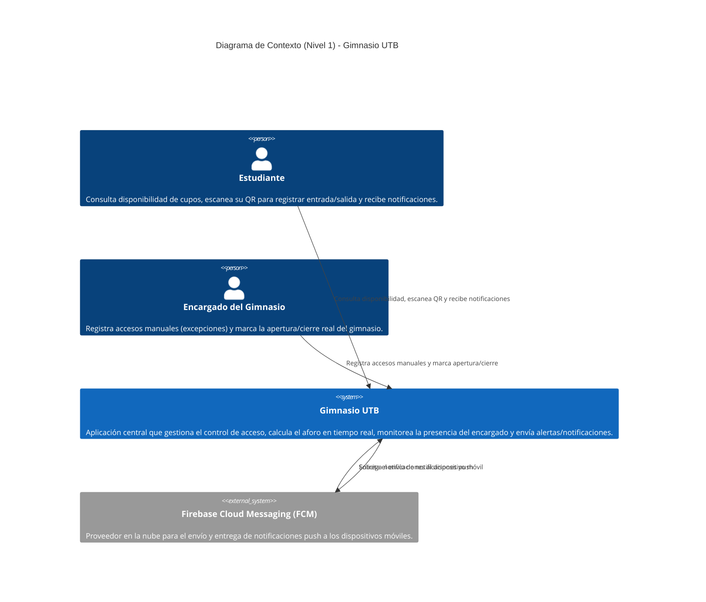

```mermaid
C4Context
    title Diagrama de Contexto (Nivel 1) - Gimnasio UTB

    Person(estudiante, "Estudiante", "Consulta disponibilidad de cupos, escanea su QR para registrar entrada/salida y recibe notificaciones.")
    Person(encargado, "Encargado del Gimnasio", "Registra accesos manuales (excepciones) y marca la apertura/cierre real del gimnasio.")

    System(gimnasio, "Gimnasio UTB", "Aplicación central que gestiona el control de acceso, calcula el aforo en tiempo real, monitorea la presencia del encargado y envía alertas/notificaciones.")

    System_Ext(fcm, "Firebase Cloud Messaging (FCM)", "Proveedor en la nube para el envío y entrega de notificaciones push a los dispositivos móviles.")

    Rel(estudiante, gimnasio, "Consulta disponibilidad, escanea QR y recibe notificaciones")
    Rel(encargado, gimnasio, "Registra accesos manuales y marca apertura/cierre")

    Rel(gimnasio, fcm, "Solicita el envío de notificaciones push")
    Rel(fcm, gimnasio, "Entrega notificaciones al dispositivo móvil")
```
