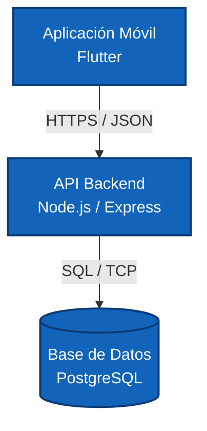
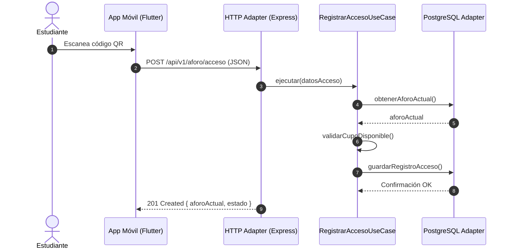
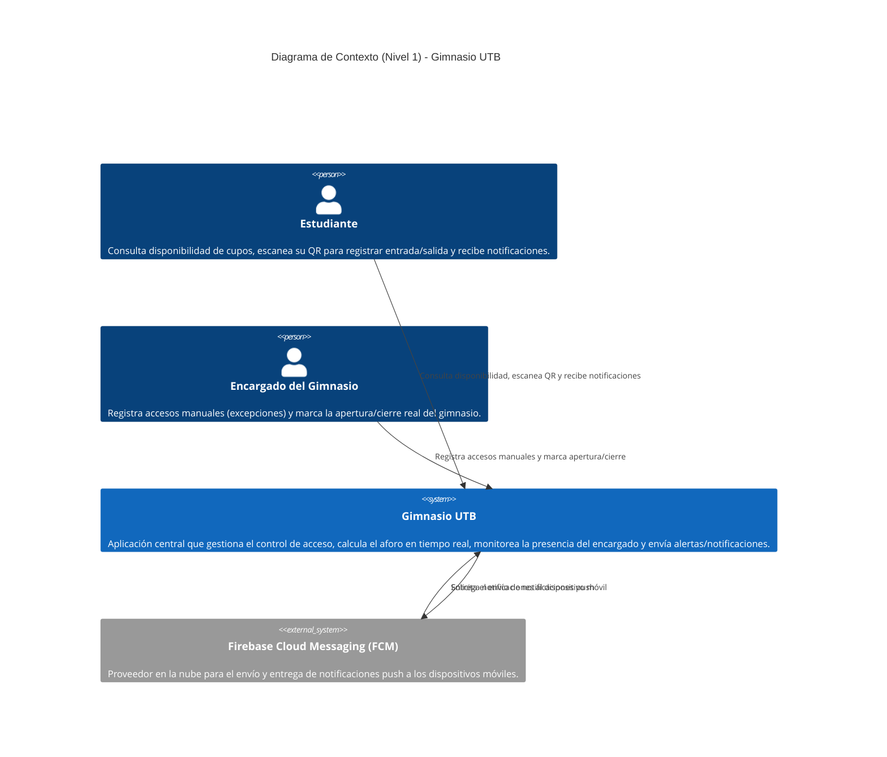

# Gimnasio UTB — Documentación de arquitectura (arc42)

**Equipo:** Sebastián Felipe Caicedo Acosta, Pedro Luis Pallares De La Hoz, Rodrigo Andrés Facio Lince Beltrán
**Curso:** Arquitectura de Software — Universidad Tecnológica de Bolívar
**Corte:** 1 (semana 4)

> Basado en arc42 Template v9.0-EN. © Dr. Peter Hruschka, Dr. Gernot Starke y colaboradores — https://arc42.org

---

# 1. Introducción y Objetivos

## 1.1 Visión general de requisitos

Los estudiantes de la UTB que quieren usar el gimnasio universitario no tienen forma de saber, antes de desplazarse, si hay cupo disponible. Esto genera desplazamientos en vano cuando el gimnasio está lleno, y en ocasiones el gimnasio permanece cerrado por ausencia del encargado sin que los estudiantes lo sepan de antemano.

**Gimnasio UTB** es una aplicación móvil que resuelve este problema mediante:

- **Registro de entrada/salida por escaneo de código QR**: El estudiante registra su entrada y salida mediante lectura de QR con la cámara de su dispositivo móvil.
- **Registro manual de excepción**: El encargado gestiona accesos de forma manual en el sistema únicamente en casos de excepción (carné olvidado o falla del lector).
- **Visualización de cupos disponibles en tiempo real**: Calculada a partir de los registros de entrada/salida.
- **Notificaciones personalizadas**: Basadas en la disponibilidad de cupos, el horario preferido del estudiante, la ocupación actual y el estado abierto/cerrado del gimnasio (que depende de un horario fijo pero también de la presencia real del encargado).

## 1.2 Objetivos de calidad

El curso define cinco atributos base para guiar el análisis (rendimiento, escalabilidad, disponibilidad, mantenibilidad, seguridad). A partir de ellos, y de las preocupaciones concretas de los interesados, el equipo priorizó lo siguiente:

| # | Atributo de calidad | Tipo | Motivación |
|---|---|---|---|
| 1 | **Consistencia de datos** | Adicional al dominio | El conteo de aforo es el dato central del sistema; un conteo incorrecto (duplicado o perdido) invalida el propósito completo de la app. |
| 2 | **Disponibilidad** | Canónico | El estado abierto/cerrado y el aforo deben reflejar la realidad operativa (presencia del encargado), y el sistema debe seguir siendo usable ante fallos de infraestructura. |
| 3 | **Rendimiento** | Canónico | Los cambios de aforo deben verse casi de inmediato en los dispositivos de los estudiantes conectados. |
| 4 | **Usabilidad operativa** | Adicional al dominio | El encargado debe poder registrar accesos manuales rápido, sin fricción, para no convertirse en cuello de botella. |
| 5 | **Escalabilidad** | Canónico | El número de usuarios concurrentes crecerá con la adopción de la app entre semestres. |
| 6 | **Seguridad** | Canónico | El aforo y los accesos deben protegerse contra QR falsificados/reutilizados y accesos no autorizados al panel del encargado. |
| 7 | **Mantenibilidad** | Canónico | Las reglas de horario y operación cambian con frecuencia (bloques, umbrales de ausencia) y deben poder ajustarse con bajo esfuerzo. |

## 1.3 Trade-off principal

**¿Qué atributo sacrificarían y a cambio de qué?**

El equipo sacrifica parte de la **velocidad de desarrollo y la disponibilidad nativa en tiempo real** que ofrecería una plataforma serverless tipo Firebase, a cambio de **consistencia transaccional garantizada** (PostgreSQL con transacciones ACID) en el conteo de aforo. La razón: un conteo de aforo incorrecto rompe la confianza del estudiante en la app y anula su propósito; en cambio, una demora de 1–2 segundos en la sincronización del dato es tolerable. Esta decisión está formalizada como restricción técnica **TC3** (sección 2.2).

## 1.4 Stakeholders

Siguiendo las dos perspectivas con las que se interpreta la calidad en este proyecto:

| Rol | Perspectiva | Preocupaciones clave | Expectativas |
|---|---|---|---|
| Estudiante (usuario primario) | Usuario y negocio | Respuesta rápida, continuidad del servicio | Saber si hay cupo antes de ir; recibir notificaciones relevantes a su horario. |
| Encargado del gimnasio (usuario operativo) | Operaciones y seguridad | Recuperación ante fallos, control del acceso | Registrar accesos rápido (QR o manual); marcar apertura/cierre sin fricción. |
| Equipo de desarrollo | Operaciones y seguridad | Trazabilidad de decisiones, control de cambios | Cumplir cortes de evaluación (semanas 5, 10, 16) con evidencia técnica defendible. |
| Docente / evaluador del curso | Operaciones y seguridad | Trazabilidad de decisiones | Decisiones de arquitectura justificadas, no solo estilo; documentación arc42 completa. |

---

# 2. Restricciones de Arquitectura

## 2.1 Restricciones organizacionales

| ID | Restricción | Origen | Justificación / impacto en la arquitectura |
|---|---|---|---|
| OC1 | Cortes de evaluación en semanas 5, 10 y 16 | Sílabo del curso | Obliga a una arquitectura desplegable de forma incremental desde el inicio, no un "big bang" al final. |
| OC2 | Documentación obligatoria en plantilla **arc42** | Criterio de evaluación del docente | Fuerza a comunicar y defender cada decisión de arquitectura de forma estructurada y trazable. |
| OC3 | Repositorio en **GitHub** con integración de **SonarCloud** | Plataforma oficial del curso | Condiciona el stack a lenguajes/frameworks con buen soporte de análisis estático (JS/TS encaja bien). |
| OC4 | Uso de IA generativa debe registrarse en `docs/ia.md` | Políticas académicas UTB | Cada decisión asistida por IA debe verificarse y quedar trazada formalmente. |
| OC5 | Equipo de 4 personas, un semestre | Limitación del proyecto académico | Limita el alcance del MVP; favorece frameworks con alta productividad (un solo lenguaje en todo el stack). |
| OC6 | Metodología ágil con evidencia semanal | Plan de trabajo de la asignatura | Requiere incrementos demostrables; refuerza la necesidad de un entorno desplegado desde etapas tempranas. |

## 2.2 Restricciones técnicas

| ID | Restricción | Origen | Justificación / impacto en la arquitectura |
|---|---|---|---|
| TC1 | **URL pública requerida desde el corte 2** (semana 10) | Requisito de evaluación del curso | Obliga a elegir una plataforma de despliegue continuo desde el corte 1 en vez de trabajar solo en local. |
| TC2 | App móvil en **Flutter** | Decisión técnica del equipo | Codebase único para Android/iOS, coherente con un equipo pequeño y tiempo limitado; evita duplicar lógica de UI. |
| TC3 | Backend en **Node.js + Express**, base de datos **PostgreSQL** | Decisión de arquitectura del equipo | Postgres da garantías **ACID**, necesarias para que el conteo de aforo sea consistente (trade-off sección 1.3). Node/Express tiene además soporte directo en SonarCloud (OC3). |
| TC4 | Despliegue en **Render** (free tier) | Presupuesto del equipo (0 USD) | Sin costo, pero implica *cold starts* tras inactividad — restricción que debe manejarse explícitamente en la app. |
| TC5 | Dependencia de hardware de cámara y API del SO | Plataformas Android / iOS | La captura de imágenes depende de la disponibilidad física de la cámara y permisos de privacidad concedidos por el usuario en el dispositivo móvil. |

## 2.3 Restricciones legales

| ID | Restricción | Origen | Justificación / impacto en la arquitectura |
|---|---|---|---|
| LC1 | Cumplimiento de la **Ley 1581 de 2012** (Protección de Datos Personales en Colombia) | Marco legal colombiano y normatividad UTB | El sistema maneja datos de identificación de estudiantes (código/carné y registros de asistencia); la arquitectura debe garantizar la encriptación de datos en tránsito y reposo, minimización de datos almacenados y consentimiento expreso para el tratamiento de su información. |

---

# 3. Contexto y Alcance

## 3.1 Contexto de negocio

El sistema tiene dos actores externos que interactúan con él directamente:

- **Estudiante**: consulta el aforo disponible, escanea su QR para registrar entrada/salida, recibe notificaciones según su horario preferido.
- **Encargado del gimnasio**: gestiona el registro manual cuando el QR no es viable, marca la apertura/cierre real del gimnasio.

*(Ver "Diagrama C4 de contexto" más abajo, con versión en código e imagen.)*

## 3.2 Contexto técnico

| Canal | Origen → Destino | Protocolo | Formato |
|---|---|---|---|
| App móvil ↔ API backend | Flutter app ↔ Node/Express | HTTPS (REST) | JSON |
| Actualización de aforo en tiempo real | Node/Express ↔ Flutter app | WebSocket (Socket.io) | JSON |
| Registro de acceso | Flutter app (lector QR) → API backend | HTTPS (REST) | JSON |
| Persistencia | API backend ↔ PostgreSQL | SQL (driver `pg`) | Filas relacionales |
| Notificaciones push | API backend → Servicio de notificaciones (FCM) → dispositivo del estudiante | HTTPS / FCM | JSON |

**Mapeo entrada/salida a canales:**

- *Entrada*: escaneo QR o registro manual → API REST → escritura transaccional en PostgreSQL.
- *Salida*: aforo actualizado → difusión por WebSocket a clientes conectados; alertas → notificación push vía FCM.

---

# 4. Estrategia de Solución

## 4.1 Decisiones tecnológicas clave

El stack ya quedó fijado y justificado como restricción técnica en la sección 2.2: **Flutter** (app móvil), **Node.js + Express** (backend) y **PostgreSQL** (persistencia), con despliegue en **Render**. La estrategia de solución de esta entrega se enfoca en **cómo se organiza el código dentro de ese backend**, para que desde la semana 4 el equipo pueda avanzar sobre una base ya montada en vez de decidir estructura sobre la marcha.

## 4.2 Matriz comparativa de estilos arquitectónicos

Se evaluaron tres estilos para organizar el backend, frente a los atributos de calidad priorizados en la sección 1.2 y las restricciones organizacionales (equipo pequeño, entregas incrementales):

| Criterio | Arquitectura en Capas | Arquitectura Hexagonal (Puertos y Adaptadores) | Monolito Modular (sin capas ni hexagonal) |
|---|---|---|---|
| Acoplamiento del dominio con el framework/DB | Alto — la lógica de negocio suele mezclarse con Express y el ORM | Bajo — el dominio no conoce Express ni PostgreSQL, solo interfaces (puertos) | Medio-alto — cada módulo resuelve su propio acoplamiento, sin regla explícita |
| Testabilidad del dominio (ES1) | Media — requiere mocks del framework para probar reglas de negocio | Alta — el dominio se prueba con funciones puras, sin levantar servidor ni DB | Variable — depende de la disciplina de cada módulo, no está garantizado por la estructura |
| Curva de aprendizaje para el equipo (OC5) | Baja — es el estilo más conocido y usado en cursos previos | Media-alta — requiere entender puertos/adaptadores, nuevo para el equipo | Baja-media — es organizar por carpetas de dominio, sin conceptos nuevos |
| Facilidad de cambio ante nuevas reglas (Mantenibilidad) | Media — un cambio de regla puede tocar varias capas transversales | Alta — cambiar una regla de negocio no toca los adaptadores de infraestructura | Media — depende de qué tan bien delimitado esté cada módulo |
| Aislamiento para validar seguridad | Media — la validación suele vivir en el controlador, junto al framework | Alta — las políticas de acceso pueden probarse como parte del dominio, desacopladas de Express | Media — igual que capas, depende del módulo |
| Velocidad para el MVP con los cortes actuales (OC1) | Alta — se escribe rápido, hay muchos ejemplos y plantillas | Media — el andamiaje inicial (puertos, adaptadores) toma más tiempo antes de la primera funcionalidad | Alta — igual de rápido que capas al inicio |
| Preparación para crecer (Escalabilidad) | Baja-media — separar módulos después implica refactor grande | Alta — cada módulo hexagonal ya está desacoplado, es más fácil extraerlo si hace falta | Media-alta — ya está modularizado, pero sin el aislamiento de dominio que facilita extraer un módulo limpiamente |
| Riesgo de sobre-ingeniería para un MVP académico | Bajo | Medio — si no se disciplina, los puertos pueden volverse ceremonia sin beneficio real | Bajo |

**Lectura de la matriz:** Capas gana en velocidad inicial y curva de aprendizaje; Monolito Modular es un punto intermedio razonable; Hexagonal es el único que responde directamente a los escenarios de calidad con mayor prioridad del árbol de utilidad (ES1, ES4), a costa de una curva de aprendizaje algo mayor. La decisión final y sus consecuencias completas están documentadas en [ADR-0001](../adr/0001-arquitectura-hexagonal.md).

## 4.3 Decisión adoptada

El equipo adopta **Arquitectura Hexagonal (Puertos y Adaptadores)**, desplegada como **un único monolito** (no microservicios), organizada internamente por módulo de dominio (empezando por el módulo `aforo`). Esto significa:

- El **dominio** (reglas de negocio puras, ej. cómo se calcula el aforo) no importa ni Express ni el driver de PostgreSQL.
- La **aplicación** define casos de uso y puertos (interfaces) que el dominio necesita (ej. "guardar un registro de acceso").
- La **infraestructura** implementa esos puertos con tecnología concreta: adaptadores HTTP (Express), de persistencia (PostgreSQL) y de tiempo real (WebSocket).

Ver el detalle completo de alternativas y consecuencias documentadas en [ADR-0001](../adr/0001-arquitectura-hexagonal.md).

---

## 5. Building Block View (Vista de Bloques de Construcción)

### 5.1 Level 1: System Overview
La estructura del sistema **Gimnasio UTB** está dividida en tres bloques principales: la aplicación móvil, la API del backend y la base de datos.



### 5.2 Level 2: Backend Internal Structure (Hexagonal Architecture)
El backend aplica el patrón de Arquitectura Hexagonal para aislar el dominio de negocio de las tecnologías externas.

```text
src/
├── server.js               # Root de composición (arranque de Express)
├── modules/
│   └── aforo/              # Módulo de Dominio del Aforo
│       ├── domain/         # Reglas puras de negocio (Entidades, Value Objects)
│       ├── application/    # Casos de uso e Interfaces de Puertos (Ports)
│       └── infrastructure/ # Adaptadores de Entrada/Salida (HTTP Express, DB PostgreSQL)
└── shared/                 # Configuración global, utilidades y errores compartidos
```

**Responsabilidades de cada capa del módulo de aforo:**
* **Domain Layer:** Define entidades puras (`Aforo`, `RegistroAcceso`, `EstadoGimnasio`) y reglas del sistema (por ejemplo, validar si el aforo excede el límite máximo). No importa dependencias externas.
* **Application Layer:** Contiene casos de uso (`RegistrarAccesoQRUseCase`, `ConsultarAforoUseCase`) y define las interfaces/puertos de entrada y salida (`AforoRepositoryPort`, `NotificationPort`).
* **Infrastructure Layer:** Implementa los adaptadores concretos.
  * **HTTP (Inbound):** Controladores de Express y validación de rutas (`/health`, `/aforo`, `/accesos`).
  * **Persistence (Outbound):** Implementación de repositorios utilizando consultas SQL sobre PostgreSQL.
  * **Messaging (Outbound):** Adaptador para interactuar con Firebase Cloud Messaging (FCM).

---

## 6. Runtime View (Vista de Ejecución)

### 6.1 Escenario 1: Registro de Entrada mediante Código QR (Estudiante)



### 6.2 Escenario 2: Notificación Push de Cambio de Estado del Gimnasio
1. El **Encargado** marca el cierre del gimnasio desde la **Aplicación Móvil**.
2. La petición llega al controlador HTTP y ejecuta el caso de uso `CambiarEstadoGimnasioUseCase`.
3. El caso de uso actualiza el estado operativo en **PostgreSQL**.
4. El caso de uso llama al puerto `NotificationPort`.
5. El adaptador **FCM (Infrastructure)** construye el payload y despacha la notificación push a los dispositivos móviles.

---

## 9. Architectural Decisions (Decisiones Arquitectónicas - ADRs)

### ADR-0001: Adopción de Arquitectura Hexagonal en el Backend
* **Estado:** Aceptado.
* **Contexto:** Se requiere un backend en Node.js/Express para la gestión de aforo que garantice mantenibilidad, facilidad para realizar pruebas automatizadas y desacoplamiento de la base de datos o frameworks web.
* **Decisión:** Organizar el módulo `src/modules/aforo` en tres capas aisladas (`domain`, `application`, `infrastructure`).
* **Consecuencias:**
  * **Positivas:** Permite escribir pruebas unitarias de la lógica del aforo sin requerir una conexión activa a PostgreSQL ni levantar Express. Facilita cambiar de proveedor de base de datos o servicio de notificaciones en el futuro.
  * **Negativas:** Incrementa levemente la complejidad estructural inicial para endpoints simples.

### ADR-0002: Despliegue en Render para Entornos de Desarrollo y Staging
* **Estado:** Aceptado.
* **Contexto:** El proyecto requiere un entorno cloud de fácil integración continua (CI/CD) desde GitHub Actions.
* **Decisión:** Desplegar el servicio de Node.js en Render mediante un plan Web Service enlazado al repositorio.
* **Consecuencias:** Permite la validación rápida de endpoints y pruebas de integración automáticas tras cada `push`.

---

## 10. Quality Requirements (Requerimientos de Calidad)

### 10.1 Árbol de Utilidad (Utility Tree)

```text
Gimnasio UTB
├── Rendimiento (Performance)
│   ├── Tiempo de respuesta del endpoint de salud (/health)
│   └── Tiempo de respuesta en la consulta de aforo en tiempo real
├── Disponibilidad (Availability)
│   └── Verificación del backend mediante CI/CD automatizado
└── Mantenibilidad (Maintainability)
    └── Pruebas unitarias de las reglas del dominio del aforo
```

### 10.2 Escenarios de Calidad

* **Escenario de Rendimiento (Consulta de Aforo):**
  * **Fuente:** Estudiante mediante la App Móvil.
  * **Estímulo:** Realiza una petición `GET /aforo` durante las horas de alta concurrencia.
  * **Entorno:** Operación normal en el servidor Render.
  * **Respuesta:** El sistema calcula y devuelve el cupo disponible.
  * **Medida de Calidad:** El tiempo de respuesta del backend es menor a **200 ms** para el 95% de las peticiones.

* **Escenario de Disponibilidad y Verificación (CI/CD):**
  * **Fuente:** Desarrollador del equipo.

# Diagrama C4 de contexto (Nivel 1)

graph TD
Estudiante[Estudiante - Usuario Principal]
Encargado[Encargado del Gimnasio - Operaciones]

Sistema[Sistema Gimnasio UTB]
FCM[Firebase Cloud Messaging - FCM]

Estudiante -->|Escanea QR, consulta aforo y recibe notificaciones| Sistema
Encargado -->|Registra accesos manuales y gestiona apertura/cierre| Sistema
Sistema -->|Envía alertas push| FCM
FCM -->|Entrega notificaciones| Estudiante

<div align="center">



</div>

El **Sistema Gimnasio UTB** es el sistema de software que gestiona el registro de entradas y salidas, el cálculo del aforo disponible, el estado operativo del gimnasio y el envío de notificaciones.

Los **estudiantes** interactúan con el sistema para consultar el aforo, registrar sus entradas y salidas y recibir información sobre la disponibilidad del gimnasio.

El **encargado del gimnasio** utiliza el sistema para gestionar los accesos y actualizar el estado real del gimnasio, incluyendo su apertura y cierre.

El sistema utiliza **Firebase Cloud Messaging (FCM)** como servicio externo para entregar las notificaciones push a los dispositivos de los estudiantes.

> **Nota:** Este es un diagrama C4 de **Contexto (Nivel 1)**. Por eso no se muestran componentes internos como Flutter, Node.js, Express, PostgreSQL o WebSocket. Esos elementos pertenecen al nivel de contenedores o niveles inferiores.

---

# Árbol de utilidad

```
Calidad del sistema — Gimnasio UTB
│
├── Rendimiento [canónico]
│   └── Refinamiento: latencia de actualización de aforo bajo carga normal
│         └── ES4 · Prioridad: Alta · Dificultad: Media
│
├── Disponibilidad [canónico]
│   ├── Refinamiento: el estado abierto/cerrado refleja la presencia real del encargado
│   │     └── ES2 · Prioridad: Alta · Dificultad: Alta
│   └── Refinamiento: continuidad del servicio ante fallos de infraestructura
│         └── ES5 · Prioridad: Media · Dificultad: Alta
│
├── Escalabilidad [canónico]
│   └── Refinamiento: crecimiento de usuarios concurrentes conectados al aforo en tiempo real
│         └── ES6 · Prioridad: Media · Dificultad: Media
│
├── Seguridad [canónico]
│   └── Refinamiento: protección contra QR falsificados/reutilizados y accesos no autorizados
│         └── ES7 · Prioridad: Alta · Dificultad: Media
│
├── Mantenibilidad [canónico]
│   └── Refinamiento: esfuerzo para ajustar reglas de horario/operación
│         └── ES8 · Prioridad: Media · Dificultad: Baja
│
├── Consistencia de datos [adicional al dominio]
│   └── Refinamiento: integridad transaccional del conteo de aforo
│         └── ES1 · Prioridad: Alta · Dificultad: Media
│
└── Usabilidad operativa [adicional al dominio]
    └── Refinamiento: eficiencia de la interacción del encargado en registro manual
          └── ES3 · Prioridad: Media · Dificultad: Baja
```

---

# Escenarios de calidad (con medida)

## ES1 — Consistencia del conteo de aforo *(Consistencia de datos)*

| Campo | Descripción |
|---|---|
| **Fuente** | Dos estudiantes escaneando su QR de entrada casi simultáneamente |
| **Estímulo** | Dos solicitudes de registro de entrada llegan al backend en la misma ventana de tiempo |
| **Artefacto** | Servicio de registro de aforo (API + tabla de ocupación en PostgreSQL) |
| **Ambiente** | Operación normal, hora pico |
| **Respuesta** | El sistema procesa ambos registros de forma atómica, sin perder ni duplicar el conteo |
| **Medida** | 100% de las transacciones concurrentes reflejan el conteo correcto en una prueba de carga con ≥20 solicitudes simultáneas; 0 inconsistencias detectadas |
| **ADR Motivado** | [ADR-0001: Selección de Arquitectura Hexagonal](../adr/0001-arquitectura-hexagonal.md) |

## ES2 — Estado real del gimnasio (abierto/cerrado) *(Disponibilidad)*

| Campo | Descripción |
|---|---|
| **Fuente** | Encargado del gimnasio |
| **Estímulo** | El encargado no ha marcado su llegada 15 minutos después del horario programado de apertura |
| **Artefacto** | Módulo de estado del gimnasio |
| **Ambiente** | Horario habitual de apertura |
| **Respuesta** | El sistema cambia automáticamente el estado visible a "cerrado" y notifica a los estudiantes con horario preferido coincidente |
| **Medida** | Cambio de estado reflejado en la app en ≤2 minutos desde que se cumple el umbral de ausencia |
| **ADR Motivado** | [ADR-0001: Selección de Arquitectura Hexagonal](../adr/0001-arquitectura-hexagonal.md) |

## ES3 — Registro manual del encargado *(Usabilidad operativa)*

| Campo | Descripción |
|---|---|
| **Fuente** | Encargado del gimnasio |
| **Estímulo** | Necesita registrar manualmente la entrada de un estudiante sin QR disponible (carné olvidado) |
| **Artefacto** | Interfaz de gestión manual de accesos |
| **Ambiente** | Operación normal |
| **Respuesta** | El encargado completa el registro manual sin pasos adicionales innecesarios |
| **Medida** | Registro completado en ≤10 segundos y máximo 2 toques, verificado en prueba de usabilidad con 5 usuarios |
| **ADR Motivado** | [ADR-0001: Selección de Arquitectura Hexagonal](../adr/0001-arquitectura-hexagonal.md) |

## ES4 — Actualización de aforo en tiempo real *(Rendimiento)*

| Campo | Descripción |
|---|---|
| **Fuente** | Estudiante |
| **Estímulo** | Escanea su QR de entrada |
| **Artefacto** | API de registro + vista de aforo en tiempo real (WebSocket) |
| **Ambiente** | Hora pico, hasta 50 usuarios concurrentes conectados a la vista de aforo |
| **Respuesta** | El conteo de aforo visible para todos los usuarios conectados se actualiza |
| **Medida** | Latencia ≤2 segundos en el percentil 95 (P95). **Población:** todos los clientes con la app abierta en la vista de aforo. **Ventana:** 30 minutos continuos en hora pico. **Carga:** hasta 50 usuarios concurrentes. **Método:** tiempo medido desde el evento de escaneo registrado en el backend hasta la recepción de la actualización por WebSocket en el cliente, instrumentado en ambos extremos. |
| **ADR Motivado** | [ADR-0001: Selección de Arquitectura Hexagonal](../adr/0001-arquitectura-hexagonal.md) |

---

# 12. Glosario

Este glosario define los términos técnicos y del dominio de negocio centrales para el sistema Gimnasio UTB, con el fin de evitar ambigüedades entre los stakeholders y el equipo de desarrollo.

| Término | Definición |
|---|---|
| **Aforo** | Número de estudiantes presentes físicamente en el gimnasio en un momento dado. Se calcula dinámicamente sumando las entradas y restando las salidas. Es el dato transaccional más crítico del sistema. |
| **Arquitectura Hexagonal** | Patrón de diseño de software (también conocido como Puertos y Adaptadores) utilizado en el backend para aislar la lógica de negocio (dominio) de las tecnologías externas como bases de datos (PostgreSQL) o frameworks web (Express). |
| **Cold Start (Arranque en frío)** | Demora inicial en el tiempo de respuesta del backend al procesar una solicitud HTTP después de un período de inactividad. Es una restricción técnica derivada del uso del plan gratuito de la plataforma Render. |
| **Estado Operativo** | Condición real de disponibilidad del gimnasio (abierto o cerrado). No depende exclusivamente del horario oficial del bloque, sino de la presencia física confirmada del encargado en las instalaciones. |
| **FCM (Firebase Cloud Messaging)** | Servicio en la nube proporcionado por Google que el sistema utiliza como infraestructura para enviar y entregar notificaciones push a los dispositivos móviles de los estudiantes. |
| **Registro de Excepción (Manual)** | Proceso operativo secundario mediante el cual el encargado del gimnasio registra la entrada o salida de un estudiante desde su propio panel, utilizado únicamente cuando falla el método principal (ej. estudiante sin carné o fallo en la cámara). |
| **Render** | Plataforma como servicio (PaaS) en la nube seleccionada para el despliegue continuo del backend (Node.js) y el alojamiento de la base de datos (PostgreSQL). |
| **Transacción ACID** | Conjunto de propiedades (Atomicidad, Consistencia, Aislamiento, Durabilidad) garantizadas por PostgreSQL al procesar registros concurrentes, asegurando que el conteo del aforo nunca se duplique o pierda bajo carga. |
|   **Estímulo:** |Realiza un `push` o `pull request` en la rama principal de GitHub.
|   **Entorno:** | Pipeline de GitHub Actions (Ubuntu / Node.js 20).
|   **Respuesta:** |Se instalan dependencias y se ejecuta la suite de pruebas (`npm test`) sobre el endpoint `/health`.
|  **Medida de Calidad:** |La prueba de salud responde con código `200 OK` y status `"ok"` en un tiempo total de ejecución del pipeline inferior a **2 minutos**.

*Documento generado como parte de la entrega del corte 1 del proyecto Gimnasio UTB. Uso de IA generativa registrado en `docs/ia.md` según lo requerido por el curso.*
