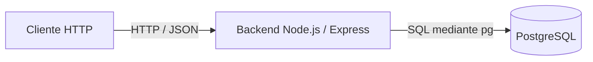
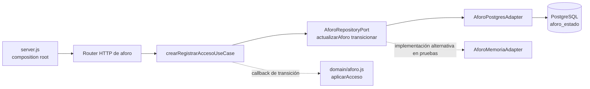
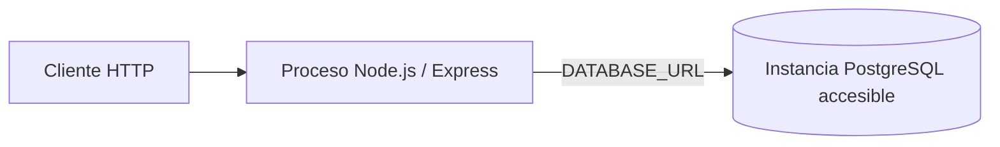

**Equipo:** Sebastián Felipe Caicedo Acosta, Pedro Luis Pallares De La Hoz, Rodrigo Andrés Facio Lince Beltrán
**Curso:** Arquitectura de Software — Universidad Tecnológica de Bolívar

> Basado en arc42 Template v9.0-EN. Este documento separa el backend comprobable del producto objetivo. “IMPLEMENTADO” se reserva para capacidades presentes en el código y respaldadas por pruebas; “OBJETIVO / FUTURO” identifica capacidades planificadas que aún no existen.

# 1. Introducción y objetivos

## 1.1 Visión general

El gimnasio de la Universidad Tecnológica de Bolívar alcanza su máxima capacidad en ciertos horarios. Los estudiantes pueden desplazarse sin saber si hay cupo; además, la disponibilidad real puede diferir del horario previsto.

El propósito del producto es ofrecer información confiable sobre la disponibilidad del gimnasio. La solución completa contempla una aplicación móvil y funciones para estudiantes y encargados. El alcance implementado en este repositorio es un backend que mantiene un contador agregado de aforo y ofrece una API HTTP para consultarlo y aplicar transiciones de entrada o salida.

## 1.2 Alcance implementado y objetivo

**IMPLEMENTADO:** backend Node.js/Express con Arquitectura Hexagonal / Ports and Adapters; módulo de aforo; caso de uso de registro; `AforoRepositoryPort`; adapters PostgreSQL y memoria; API HTTP; transacciones con bloqueo de fila; readiness, liveness, métricas locales, logs estructurados y cierre ordenado ante `SIGTERM`.

**OBJETIVO / FUTURO:** aplicación Flutter; QR e identidad de estudiantes; autenticación y roles; historial de accesos y deduplicación por estudiante; registro manual; estado operativo de apertura/cierre; WebSocket; FCM; Render; PostgreSQL gestionado; IaC; SonarCloud/Quality Gate y definición final de costos.

El backend actual no identifica personas. Su contador no constituye un registro de quién está dentro del gimnasio.

## 1.3 Objetivos de calidad

- **Consistencia del contador:** serializar transiciones PostgreSQL concurrentes y no perder actualizaciones en el escenario probado.
- **Mantenibilidad:** aislar el dominio de Express y del driver PostgreSQL mediante el puerto de persistencia.
- **Operación verificable:** separar liveness (`/health`) de readiness (`/ready`) y consultar contadores operacionales (`/metrics`).

Rendimiento bajo carga, alta disponibilidad cloud, seguridad de identidad y experiencia de uso móvil son objetivos futuros; no cuentan con evidencia de implementación en este backend.

## 1.4 Stakeholders

| Stakeholder | Interés y estado |
|---|---|
| Estudiantes | Quieren conocer la disponibilidad. La aplicación y la identidad de estudiante están pendientes. |
| Encargado del gimnasio | Requeriría operar registros manuales y apertura/cierre. Estas capacidades están pendientes. |
| Bienestar Universitario y área administrativa | Interesados en la gestión del aforo y el uso del gimnasio. |
| Equipo de desarrollo y evaluadores | Necesitan decisiones trazables y evidencia verificable por corte académico. |

# 2. Restricciones de arquitectura

## 2.1 Organizacionales y académicas

La solución se desarrolla como proyecto académico incremental y su arquitectura debe poder explicarse y verificarse. El uso de IA debe registrarse conforme a las políticas del curso.

**OBJETIVO / FUTURO:** URL pública, Render, integración de SonarCloud y Quality Gate. Son metas o requisitos del proyecto, no capacidades desplegadas o configuradas actualmente.

## 2.2 Técnicas implementadas

- Node.js 18 o superior, Express y `pg`.
- El servidor real crea `AforoPostgresAdapter` y requiere `DATABASE_URL`.
- `npm run db:init` ejecuta `src/modules/aforo/infrastructure/persistence/schema.sql`.
- El esquema contiene una fila de estado con `id = 1` y un contador entero no negativo.
- El adapter PostgreSQL aplica cada transición en una transacción y bloquea la fila antes de modificarla.
- `createApp()` acepta un repositorio inyectado y usa el adapter en memoria por defecto, lo que permite pruebas sin base de datos.

## 2.3 Restricciones y requisitos futuros

Flutter, cámara, QR, datos personales, autenticación, autorización, notificaciones, WebSocket, alojamiento cloud y base gestionada todavía no forman parte del código implementado. Los requisitos legales relacionados con identificación y datos personales deberán analizarse cuando esas funciones se incorporen; este documento no afirma que ya estén implementadas ni que exista una evaluación de cumplimiento.

# 3. Contexto y alcance del sistema

## 3.1 Contexto de negocio

El problema de negocio es informar y gestionar la ocupación del gimnasio. El backend implementado expone un contador agregado; no recibe ni valida identidad, QR o roles. Estudiantes y encargados son stakeholders del producto objetivo, pero el backend actual no los representa como actores autenticados.

## 3.2 Contexto técnico implementado


```mermaid
flowchart LR
    Cliente[Cliente HTTP] -->|HTTP / JSON| API[Backend Node.js / Express]
    API -->|SQL mediante pg| DB[(PostgreSQL)]
```

El cliente HTTP invoca la API. El servidor real persiste el contador en PostgreSQL mediante `AforoPostgresAdapter`. En pruebas, `createApp()` puede componer `AforoMemoriaAdapter`.

**OBJETIVO / FUTURO:** conectar una aplicación Flutter y añadir identidad/QR, notificaciones, estado operativo, WebSocket y FCM. Estos elementos no se muestran como dependencias activas del backend.

## 3.3 Interfaces HTTP implementadas

- `GET /health`: liveness estático.
- `GET /ready`: consulta el repositorio; responde `503` si la lectura falla.
- `GET /metrics`: devuelve `access_operations_total` en memoria, separado en `entrada`, `salida` y `total`.
- `GET /api/v1/aforo`: consulta el contador actual.
- `POST /api/v1/aforo/acceso`: acepta `tipoAcceso` con valor `ENTRADA` o `SALIDA`.

Los contratos y cuerpos de respuesta están descritos en `docs/openapi.yaml`; las rutas de aforo se implementan en `src/modules/aforo/infrastructure/http/aforo.router.js`.

# 4. Estrategia de solución

## 4.1 Arquitectura implementada

El backend es un monolito organizado con Arquitectura Hexagonal / Ports and Adapters:

- **Dominio:** `src/modules/aforo/domain/aforo.js` valida y calcula la transición del contador, sin depender de Express ni PostgreSQL.
- **Aplicación:** `registrar-acceso.usecase.js` recibe el repositorio y delega una transición.
- **Puerto:** `AforoRepositoryPort` define `obtenerAforoActual()` y `actualizarAforo(transicionar)`.
- **Infraestructura:** Express implementa el adapter HTTP; `AforoPostgresAdapter` y `AforoMemoriaAdapter` implementan el contrato de persistencia.
- **Composición:** `src/server.js` usa PostgreSQL al ejecutar el servidor real y permite inyectar otro repositorio en `createApp()`.

## 4.2 Persistencia y observabilidad

PostgreSQL conserva el contador actual. El adapter ejecuta la transición en una transacción y usa `SELECT ... FOR UPDATE` para serializar modificaciones sobre la fila. Ante errores intenta `ROLLBACK`; si la operación termina correctamente confirma con `COMMIT`.

La observabilidad implementada es básica: logs JSON en stdout, `/health`, `/ready` y `/metrics`. La métrica es local al proceso; no se integra con Prometheus ni con un agregador externo.

## 4.3 Arquitectura objetivo

**OBJETIVO / FUTURO:** añadir los componentes móviles y operativos descritos en la visión, junto con despliegue, identidad, historial y canales de notificación. No forman parte de la estrategia runtime implementada actualmente.

# 5. Vista de bloques

## 5.1 Composición y flujo de dependencias


```mermaid
flowchart LR
    SERVER[server.js<br/>composition root] --> ROUTER[Router HTTP de aforo]
    ROUTER --> UC[crearRegistrarAccesoUseCase]
    UC --> PORT[AforoRepositoryPort<br/>actualizarAforo transicionar]
    PORT --> PG[AforoPostgresAdapter]
    PG --> DB[(PostgreSQL<br/>aforo_estado)]
    UC -. callback de transición .-> DOMAIN[domain/aforo.js<br/>aplicarAcceso]
    PORT -. implementación alternativa en pruebas .-> MEM[AforoMemoriaAdapter]
```

El composition root inyecta el repositorio. El adapter de memoria es una implementación alternativa del puerto y se usa por defecto en las pruebas de `createApp()` que no requieren PostgreSQL.

## 5.2 Bloques existentes y responsabilidades

| Bloque | Responsabilidad | Evidencia |
|---|---|---|
| Composition root | Construye Express, selecciona/injecta repositorio, registra health, readiness y métricas. | `src/server.js` |
| Adapter HTTP | `POST /acceso` invoca el caso de uso; `GET /` usa el getter de aforo que el composition root entrega al router. | `src/modules/aforo/infrastructure/http/aforo.router.js`, `src/server.js` |
| Caso de uso | Pide al repositorio una actualización atómica usando una función de transición. | `src/modules/aforo/application/registrar-acceso.usecase.js` |
| Dominio | Acepta `ENTRADA`/`SALIDA` y rechaza tipos inválidos o salida desde cero. | `src/modules/aforo/domain/aforo.js` |
| Puerto | Contrato de lectura y transición atómica. | `src/modules/aforo/application/ports/aforo-repository.port.js` |
| Adapter PostgreSQL | Ejecuta transacción, bloqueo de fila, actualización y rollback. | `src/modules/aforo/infrastructure/persistence/aforo-postgres.adapter.js` |
| Adapter en memoria | Implementación en RAM del mismo puerto. | `src/modules/aforo/infrastructure/persistence/aforo-memoria.adapter.js` |
| Esquema | Una fila para `aforo_actual`, restringida a `id = 1` y valor no negativo. No guarda estudiantes ni eventos. | `src/modules/aforo/infrastructure/persistence/schema.sql` |

No existen en los bloques implementados entidades `RegistroAcceso` o `EstadoGimnasio`, usuarios, estudiantes, historial, notificaciones, WebSocket o Firebase.

# 6. Vista de ejecución

## 6.1 Registrar una entrada o salida

**Flujo exitoso implementado:**

```text
POST /api/v1/aforo/acceso
  -> router HTTP
  -> crearRegistrarAccesoUseCase
  -> AforoRepositoryPort.actualizarAforo(transicionar)
  -> AforoPostgresAdapter
  -> BEGIN
  -> SELECT aforo_actual ... FOR UPDATE
  -> ejecutar transición de dominio aplicarAcceso(...)
  -> UPDATE aforo_estado
  -> COMMIT
  -> HTTP 201 { status: "success", data: { aforoActual } }
```

Si la transición o una sentencia PostgreSQL falla después de iniciar la transacción, el adapter intenta `ROLLBACK` y vuelve a propagar el error. Para `POST /acceso`, los errores de dominio responden `400`; los fallos clasificados del repositorio responden `503` con un mensaje genérico; y los errores inesperados responden `500` con un mensaje genérico. El JSON malformado se normaliza a `400` JSON en la composición Express. Los logs de entrada/dominio usan `warn`; los de infraestructura o errores inesperados usan `error` sin exponer el mensaje interno en la respuesta.

La prueba de integración PostgreSQL comprueba rechazo de salida desde cero y rollback cuando PostgreSQL rechaza una actualización mediante un trigger.

## 6.2 Consultar el contador

`GET /api/v1/aforo` llama a `obtenerAforoActual()` y, si la consulta termina correctamente, responde `200` con `{ status: "success", data: { aforoActual } }`. La consulta de lectura no ejecuta una transición.

## 6.3 Funcionalidad futura

El escaneo QR, identificación del estudiante, corrección manual por un encargado, apertura/cierre, difusión WebSocket y notificaciones FCM no forman parte de estos flujos implementados.

# 7. Vista de despliegue

## 7.1 Topología actual/local


```mermaid
flowchart LR
    Cliente[Cliente HTTP] --> API[Proceso Node.js / Express]
    API -->|DATABASE_URL| DB[(Instancia PostgreSQL accesible)]
```

El proceso real inicia `AforoPostgresAdapter` y necesita `DATABASE_URL`. Antes de usarlo, `npm run db:init` crea e inicializa la tabla. `npm start` ejecuta el servidor. El puerto predeterminado está definido en `src/server.js`.

`createApp({ aforoRepository })` permite inyectar un repositorio; sin argumento utiliza `AforoMemoriaAdapter`, como en las pruebas que no requieren base de datos. Esto no cambia el adapter elegido por el servidor real.

`/health` es liveness estático. `/ready` prueba una lectura del repositorio y responde `503` si falla. `/metrics` expone contadores locales del proceso. En `SIGTERM`, el servidor deja de aceptar conexiones, espera el cierre HTTP y luego cierra el pool PostgreSQL.

> El despliegue en Render, PostgreSQL gestionado, IaC/render.yaml y la definición final de costos todavía son objetivos de implementación.

No existe una URL pública documentada ni una topología cloud desplegada en este repositorio.

# 8. Conceptos transversales

## 8.1 Separación hexagonal

**IMPLEMENTADO:** dominio, aplicación, puerto e infraestructura están separados. El caso de uso depende del contrato del repositorio, no de `pg`; el adapter PostgreSQL es infraestructura. El adapter de memoria permite pruebas sin DB.

## 8.2 Persistencia y consistencia

**IMPLEMENTADO:** el contador persistido es una única fila de `aforo_estado`. Cada transición PostgreSQL comienza con `BEGIN`, obtiene el bloqueo de fila con `SELECT ... FOR UPDATE`, calcula el nuevo valor mediante la función de dominio, ejecuta `UPDATE` y confirma con `COMMIT`. En error intenta `ROLLBACK`. Esto respalda la consistencia del contador para las operaciones y escenarios probados; no identifica estudiantes ni evita duplicados por estudiante.

## 8.3 Salud y ciclo de vida

- **IMPLEMENTADO — `/health`:** liveness estático, no comprueba PostgreSQL.
- **IMPLEMENTADO — `/ready`:** consulta el repositorio; falla con `503` si no puede leer.
- **IMPLEMENTADO — `SIGTERM`:** drena el servidor HTTP y después cierra el pool PostgreSQL.

## 8.4 Logs y métricas

**IMPLEMENTADO:** `src/shared/logger.js` emite registros JSON con `timestamp`, `level`, `event` y `message`. Los callsites registran eventos de acceso, arranque y apagado con mensajes que no incluyen credenciales, `DATABASE_URL`, tokens ni payloads.

`GET /metrics` devuelve `access_operations_total` con `entrada`, `salida` y `total`. Cuenta operaciones completadas correctamente; el estado está en memoria, es por instancia/proceso y se reinicia con el proceso. No es Prometheus ni demuestra por sí misma consistencia concurrente. La evidencia de concurrencia es la prueba PostgreSQL descrita en la sección 10.

## 8.5 Conceptos futuros

**OBJETIVO / FUTURO:** autenticación, autorización/roles, identidad, QR, historial, deduplicación por estudiante, WebSocket y FCM. No hay adapters ni lógica implementada para esas capacidades.

# 9. Decisiones arquitectónicas

| Decisión | Estado y evidencia | ADR / formalización |
|---|---|---|
| Arquitectura Hexagonal / Ports and Adapters en un backend monolítico. | **IMPLEMENTADO:** dominio puro, caso de uso, puerto y adapters. | [ADR-0001](../adr/0001-arquitectura-hexagonal.md). |
| Comandos y consultas HTTP síncronos; persistencia completada antes de responder. | **IMPLEMENTADO** para las rutas actuales de aforo. | [ADR-0003](../adr/0003-comunicacion-sincrona-asincrona.md) respalda el enfoque síncrono. Su decisión FCM permanece futura. |
| PostgreSQL como persistencia del contador con transacción y bloqueo de fila. | **IMPLEMENTADO:** `AforoPostgresAdapter`, `schema.sql` y pruebas de persistencia, rollback y concurrencia. | [ADR-0004](../adr/0004-concurrencia-postgresql.md) documenta el bloqueo pesimista con `SELECT ... FOR UPDATE`, la transacción y la evidencia del escenario probado. |
| Render como plataforma de despliegue. | **OBJETIVO / FUTURO:** no hay servicio desplegado ni IaC en el repositorio. | La versión anterior del arc42 lo registraba como ADR-0002 dentro de este documento. Debe leerse como objetivo, no como despliegue realizado; no se modifica ni se atribuye un ADR independiente. |
| Métricas en memoria, logs JSON y cierre ante SIGTERM. | **IMPLEMENTADO** en la composición del servidor y `src/shared/logger.js`. | No hay ADR independiente para estas decisiones operativas básicas. |

# 10. Requisitos de calidad

## 10.1 Atributos y alcance de evidencia

| Atributo | Objetivo o evidencia actual |
|---|---|
| Consistencia del contador | Hay evidencia de transacciones y concurrencia en la prueba de PostgreSQL de la sección 10.2. No prueba identidad ni deduplicación. |
| Mantenibilidad | La separación hexagonal está reflejada en el código y las pruebas unitarias del dominio. |
| Operabilidad | `/health`, `/ready`, logs, `/metrics` y el cierre por `SIGTERM` existen. Las pruebas de health/readiness verifican respuestas, no un SLA de disponibilidad. |
| Rendimiento, escalabilidad, seguridad de identidad y disponibilidad cloud | **OBJETIVO / FUTURO o no medido.** No hay benchmark HTTP, prueba WebSocket, despliegue cloud ni autenticación que respalden umbrales cuantitativos. |

## 10.2 S1 — Concurrencia sobre el contador de aforo

| Campo | Descripción |
|---|---|
| Escenario | Veinte operaciones concurrentes de entrada sobre el contador de aforo. |
| Artefacto | `AforoPostgresAdapter.actualizarAforo()` y la fila `aforo_estado`. |
| Evidencia | `tests/postgres/aforo-postgres.integration.test.js` ejecuta veinte llamadas concurrentes al adapter PostgreSQL. También comprueba persistencia entre instancias del adapter, rechazo de salida cuando el contador es cero y rollback ante un error producido por PostgreSQL. |
| Resultado | Las veinte operaciones se completan y el aforo final es 20. En la prueba implementada de 20 operaciones concurrentes contra el adapter PostgreSQL no se observaron lost updates y el estado final coincidió con las operaciones exitosas. |
| Límite | Es una prueba de integración del adapter, no una prueba de carga HTTP. No demuestra unicidad, identidad, QR ni deduplicación por estudiante, ni garantiza resultados ante cualquier carga. |

Los resultados reportados para la suite actual son: pruebas base 12/12, contrato 11/11 y PostgreSQL 8/8. La suite PostgreSQL requiere `DATABASE_URL` de prueba; su ausencia hace que Node test la omita.

## 10.3 Otros escenarios

- `/health` responde liveness estático y `/ready` prueba la lectura del repositorio; hay pruebas de sus respuestas. Esto no mide disponibilidad cloud.
- `/metrics` tiene prueba de conteo de entradas y salidas completadas. No es una prueba de consistencia ni un benchmark.
- Umbrales de 200 ms, P95 de WebSocket, carga de 50 clientes, cambio automático de apertura/cierre y notificaciones en dos minutos no cuentan con implementación/evidencia actual. Si se conservan como metas académicas, deben etiquetarse como objetivos futuros no medidos.

# 11. Riesgos y deuda técnica

Los siguientes puntos son límites actuales, no mitigaciones implementadas:

- No existe identidad de estudiantes, autenticación ni autorización/roles.
- No existe deduplicación por estudiante, validación QR ni historial de accesos; la persistencia guarda solo el contador agregado.
- `/metrics` es local a cada instancia, se pierde al reiniciar y no agrega datos entre procesos.
- No existe despliegue cloud, Render, PostgreSQL gestionado ni `render.yaml`/IaC.
- CI todavía no aprovisiona PostgreSQL ni ejecuta `test:postgres`.
- SonarCloud/Quality Gate y una estrategia final de costos cloud no están implementados.
- Flutter, QR, WebSocket, FCM, registro manual y estado operativo permanecen pendientes.

# 12. Glosario

| Término | Definición y estado |
|---|---|
| **Aforo** | Contador agregado de ocupación que mantiene el backend. No identifica físicamente a cada persona. |
| **Transición de aforo** | Cambio del contador por `ENTRADA` o `SALIDA`, validado por `aplicarAcceso`. |
| **AforoRepositoryPort** | Contrato de persistencia con lectura actual y actualización mediante `actualizarAforo(transicionar)`. |
| **Bloqueo de fila** | Bloqueo PostgreSQL obtenido por `SELECT ... FOR UPDATE` dentro de la transacción del adapter. |
| **Liveness** | Señal de proceso disponible; en este backend la entrega `GET /health` sin consultar la base de datos. |
| **Readiness** | Comprobación de que el repositorio puede responder; la entrega `GET /ready`. |
| **Métrica operacional** | Contador `access_operations_total` en memoria por instancia, servido en JSON por `GET /metrics`; no es Prometheus. |
| **Adapter de memoria** | Implementación en RAM de `AforoRepositoryPort`, usada por defecto en `createApp()` y pruebas sin DB. |
| **QR e identidad** | **OBJETIVO / FUTURO:** medios de identificar estudiantes que todavía no existen en el backend. |
| **Historial de accesos** | **OBJETIVO / FUTURO:** registros individuales; el esquema actual solo almacena el contador agregado. |
| **WebSocket y FCM** | **OBJETIVO / FUTURO:** canales de tiempo real y notificaciones no implementados. |
| **Render y cold start** | **OBJETIVO / FUTURO:** plataforma y efecto operativo que solo aplicarán si se realiza el despliegue. |
| **Flutter** | **OBJETIVO / FUTURO:** cliente móvil no incluido en el backend actual. |

*Documento de arquitectura académica del proyecto Gimnasio UTB. El uso de IA se registra en `docs/ia.md`.*
