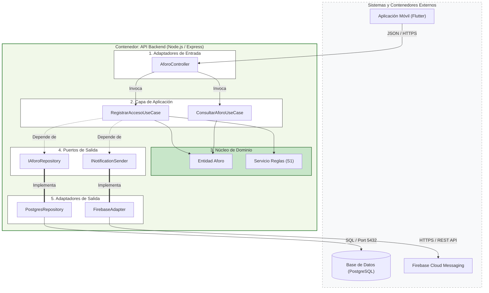

```mermaid
flowchart TB
    %% Contenedores Externos (Alineados con el Nivel 2)
    subgraph EXTERNAL["Sistemas y Contenedores Externos"]
        APP["Aplicación Móvil (Flutter)"]
        DB[("Base de Datos (PostgreSQL)")]
        FCM["Firebase Cloud Messaging"]
    end

    %% Backend Hexagonal
    subgraph BACKEND["Contenedor: API Backend (Node.js / Express)"]
        direction TB
        
        subgraph ADAPTERS_IN["1. Adaptadores de Entrada"]
            CTRL["AforoController"]
        end
        
        subgraph APP_LAYER["2. Capa de Aplicación"]
            UC_REGISTRAR["RegistrarAccesoUseCase"]
            UC_CONSULTAR["ConsultarAforoUseCase"]
        end
        
        subgraph DOMAIN_LAYER["3. Núcleo de Dominio"]
            ENT_AFORO["Entidad Aforo"]
            VAL_RULES["Servicio Reglas (S1)"]
        end
        
        subgraph PORTS_OUT["4. Puertos de Salida"]
            PORT_REPO["IAforoRepository"]
            PORT_NOTIF["INotificationSender"]
        end
        
        subgraph ADAPTERS_OUT["5. Adaptadores de Salida"]
            ADAPT_REPO["PostgresRepository"]
            ADAPT_NOTIF["FirebaseAdapter"]
        end
    end

    %% Relaciones Externas (Con protocolos exactos del Nivel 2)
    APP -->|JSON / HTTPS| CTRL
    ADAPT_REPO -->|SQL / Port 5432| DB
    ADAPT_NOTIF -->|HTTPS / REST API| FCM

    %% Flujo Interno (Inversión de Dependencias)
    CTRL -->|Invoca| UC_REGISTRAR & UC_CONSULTAR
    
    UC_REGISTRAR --> ENT_AFORO & VAL_RULES
    UC_CONSULTAR --> ENT_AFORO
    
    UC_REGISTRAR -.->|Depende de| PORT_REPO & PORT_NOTIF
    
    PORT_REPO ===|Implementa| ADAPT_REPO
    PORT_NOTIF ===|Implementa| ADAPT_NOTIF

    %% Estilos sobrios
    style EXTERNAL fill:#f8f9fa,stroke:#9e9e9e,stroke-width:1px,stroke-dasharray: 5 5
    style BACKEND fill:#f1f8e9,stroke:#2e7d32,stroke-width:2px
    style ADAPTERS_IN fill:#ffffff,stroke:#333
    style APP_LAYER fill:#ffffff,stroke:#333
    style DOMAIN_LAYER fill:#c8e6c9,stroke:#1b5e20,stroke-width:1.5px
    style PORTS_OUT fill:#ffffff,stroke:#333
    style ADAPTERS_OUT fill:#ffffff,stroke:#333
```
