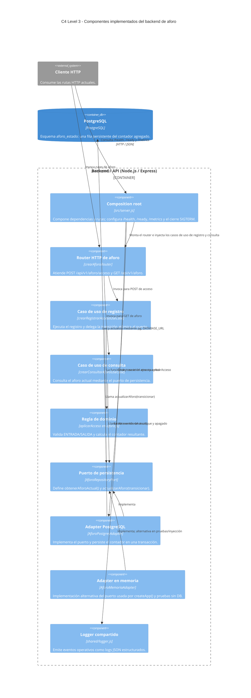

## Responsabilidades implementadas

- `server.js` es el composition root. En el arranque real crea `AforoPostgresAdapter`; `createApp()` admite inyección y usa memoria por defecto. También compone `/health`, `/ready`, `/metrics` y el cierre ordenado ante `SIGTERM`.
- `crearAforoRouter` recibe las solicitudes HTTP de aforo y devuelve las respuestas definidas por la implementación. `POST /acceso` pasa por `crearRegistrarAccesoUseCase`; `GET /` pasa por `crearConsultarAforoUseCase`, ambos compuestos e inyectados desde `server.js`.
- `crearRegistrarAccesoUseCase` llama `actualizarAforo(transicionar)`. La transición invoca `aplicarAcceso` en `aforo.js` con el valor actual.
- `crearConsultarAforoUseCase` lee el aforo actual mediante `AforoRepositoryPort.obtenerAforoActual()`.
- `AforoPostgresAdapter` ejecuta `BEGIN`, `SELECT ... FOR UPDATE`, actualización y `COMMIT`; ante errores intenta `ROLLBACK`. Esa secuencia es comportamiento del componente, no un componente separado.
- `AforoMemoriaAdapter` implementa el puerto para composición alternativa y pruebas; no es el adapter elegido por el servidor real.
- `shared/logger.js` proporciona logs estructurados JSON para eventos operativos. El composition root también protege el resultado del caso de uso ante fallos al registrar eventos de acceso.

## Arquitectura objetivo / futura

**No implementado actualmente:** integración funcional de la UI Flutter con el backend, QR, identidad de estudiantes, autenticación, roles, historial, deduplicación, estado de apertura/cierre, WebSocket, FCM, API Gateway, Redis, servicios separados y componentes de usuarios o notificaciones. El proyecto Flutter/UI existe fuera de estos componentes, pero no se ha verificado que consuma la API.
