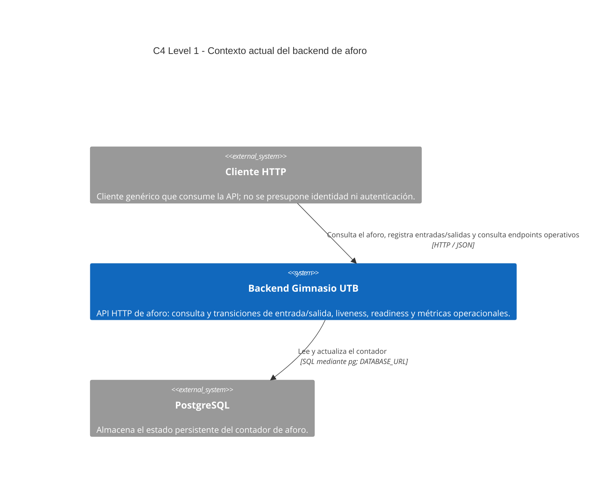

## Arquitectura objetivo / futura

**No implementado actualmente.** La visión del producto puede incluir estudiantes y encargados, una aplicación Flutter, identidad, autenticación, QR, apertura/cierre del gimnasio, historial, WebSocket y FCM. Estos elementos no forman parte del contexto actual ni tienen conexiones mostradas en el diagrama principal.
