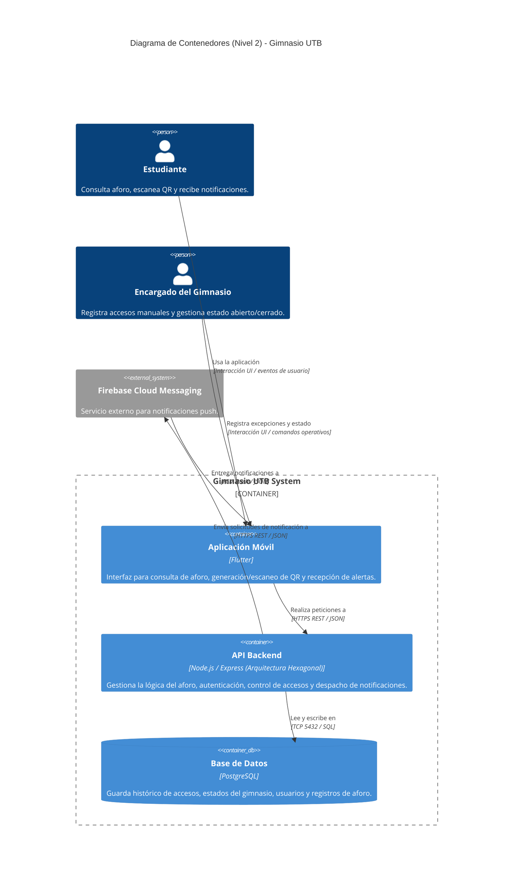

```mermaid
C4Container
    title Diagrama de Contenedores (Nivel 2) - Gimnasio UTB

    Person(estudiante, "Estudiante", "Consulta aforo, escanea QR y recibe notificaciones.")
    Person(encargado, "Encargado del Gimnasio", "Registra accesos manuales y gestiona estado abierto/cerrado.")

    Container_Boundary(c1, "Gimnasio UTB System") {
        Container(app, "Aplicación Móvil", "Flutter", "Interfaz para consulta de aforo, generación/escaneo de QR y recepción de alertas.")
        Container(api, "API Backend", "Node.js / Express (Arquitectura Hexagonal)", "Gestiona la lógica del aforo, autenticación, control de accesos y despacho de notificaciones.")
        ContainerDb(db, "Base de Datos", "PostgreSQL", "Guarda histórico de accesos, estados del gimnasio, usuarios y registros de aforo.")
    }

    System_Ext(fcm, "Firebase Cloud Messaging", "Servicio externo para notificaciones push.")

    Rel(estudiante, app, "Usa la aplicación", "Interacción UI / eventos de usuario")
    Rel(encargado, app, "Registra excepciones y estado", "Interacción UI / comandos operativos")
    
    Rel(app, api, "Realiza peticiones a", "HTTPS REST / JSON")
    Rel(api, db, "Lee y escribe en", "TCP 5432 / SQL")
    Rel(api, fcm, "Envía solicitudes de notificación a", "HTTPS REST / JSON")
    Rel(fcm, app, "Entrega notificaciones a", "FCM Push / JSON")
```
