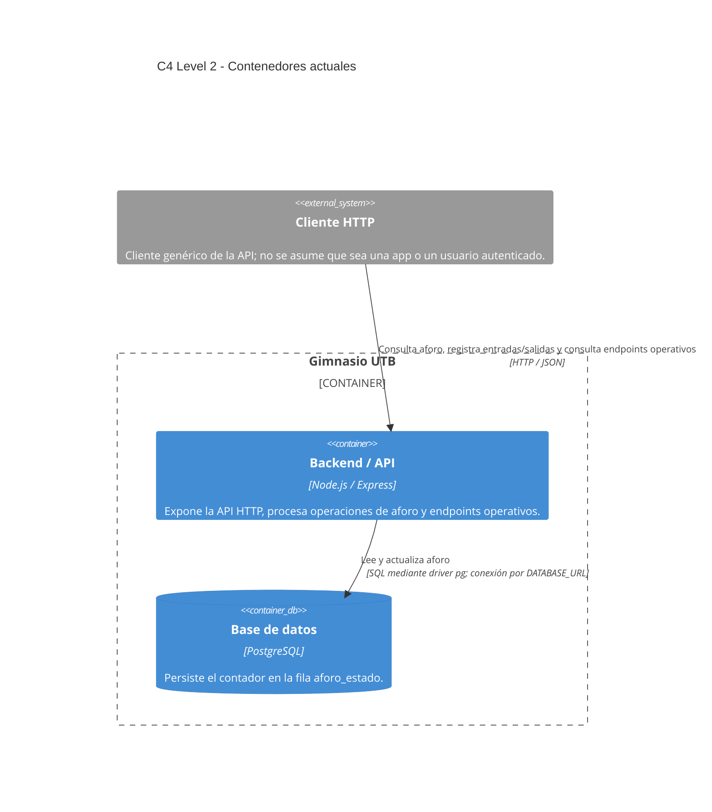

## Contenedores y evidencia

- **Backend / API:** el proceso real se inicia desde `src/server.js`; usa Express y compone `AforoPostgresAdapter`. La aplicación expone las rutas del módulo de aforo y `/health`, `/ready` y `/metrics`.
- **PostgreSQL:** `src/modules/aforo/infrastructure/persistence/schema.sql` crea `aforo_estado`, con una única fila permitida para el contador y restricción de valor no negativo.
- **Adapters internos:** `AforoPostgresAdapter` es la implementación usada por el servidor real. `AforoMemoriaAdapter` es una alternativa inyectable y se usa por defecto en `createApp()` para pruebas sin PostgreSQL. Ninguno es un contenedor separado.
- El adapter PostgreSQL realiza transacciones con bloqueo de fila; el detalle pertenece a la vista de componentes/ejecución, no representa un servicio adicional.

## Arquitectura objetivo / futura

**No implementado actualmente:** aplicación Flutter, identidad/autenticación/roles, QR, historial, deduplicación, WebSocket, FCM, Render, PostgreSQL gestionado e infraestructura como código. No son contenedores ni conexiones del sistema actual.
