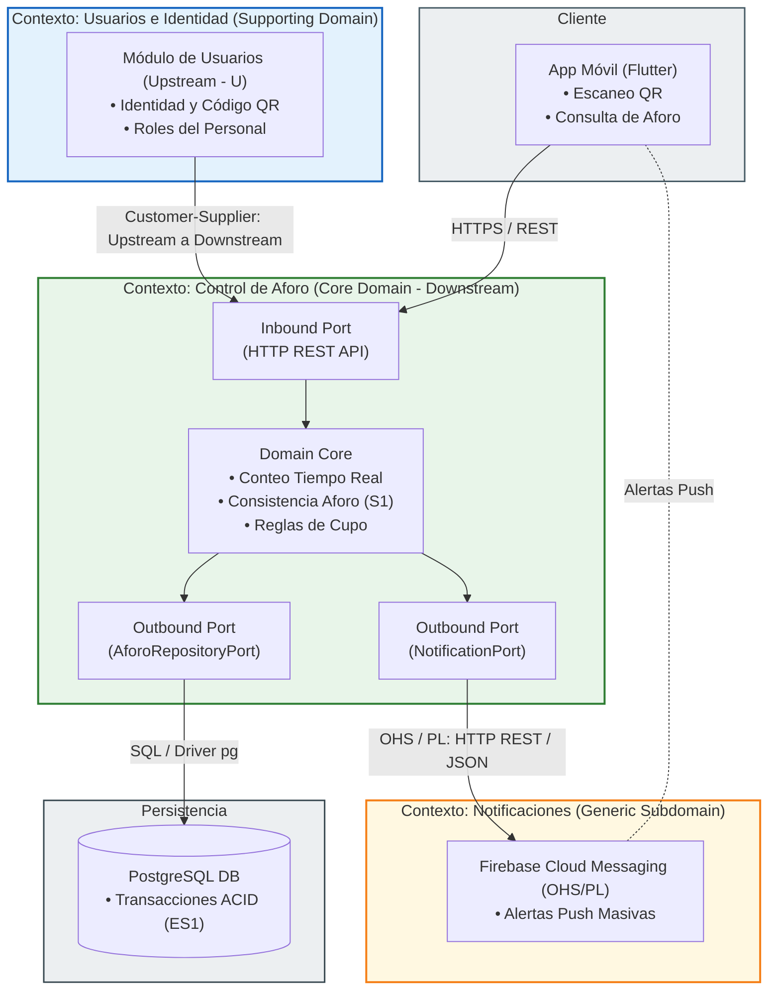

# Contextos Delimitados y Propiedad de Datos

Evidencia S6 — Domain-Driven Design aplicado a Gimnasio UTB.

Este documento identifica los contextos delimitados del dominio a partir del lenguaje de los interesados (`docs/problema.md`), asigna la propiedad de los datos por módulo evitando escrituras compartidas, y documenta las violaciones detectadas en el código actual junto con su plan de corrección.

## Mapa de contextos

## Tabla módulo → dato → dueño único

| Contexto / Módulo | Dato del que es **dueño** (único que escribe) | Quién puede **leerlo** (sin escribir) | Estado |
|---|---|---|---|
| **Aforo** | Contador de ocupación actual; historial de eventos de entrada/salida | Notificaciones (para decidir si envía push), Gestión Operativa (para mostrar en panel del encargado) | Implementado (solo el contador; el historial de eventos aún no se persiste) |
| **Identidad / Estudiante** | Perfil del estudiante; código QR asociado; preferencias de horario para notificaciones | Aforo (para validar quién registra el acceso), Notificaciones (para saber a quién y cuándo notificar) | No implementado |
| **Gestión Operativa (Encargado)** | Estado de apertura/cierre del gimnasio; marca de "corrección manual" sobre un evento de acceso | Aforo (para bloquear registros si está cerrado), app del estudiante (solo lectura del estado) | No implementado |
| **Notificaciones** | Log de notificaciones enviadas; estado de suscripción push del dispositivo | — (nodo terminal, nadie más necesita leer esto) | No implementado |

**Regla que se debe respetar al crecer:** Aforo nunca escribe preferencias del estudiante, y Notificaciones nunca escribe el contador de aforo — solo lo lee. Esa separación es la que permitiría, si se quisiera, extraer Notificaciones como servicio aparte sin tocar Aforo.

## Violaciones detectadas en el código actual y plan de corrección

No existen violaciones de **escritura cruzada entre módulos**, porque hoy solo hay un módulo implementado (Aforo) — no hay otro módulo escribiendo su dato. Sin embargo, se detectaron dos riesgos de diseño ya presentes en el código, que se convertirán en violaciones reales en cuanto se agreguen Notificaciones o Encargado si no se corrigen antes.

| # | Violación / riesgo detectado | Dónde está | Por qué es un problema | Plan de corrección |
|---|---|---|---|---|
| V1 | El estado del aforo (`this.aforoActual`) es una propiedad pública mutable del adaptador, no encapsulada | `src/modules/aforo/infrastructure/persistence/aforo-memoria.adapter.js` | Cualquier código dentro del mismo proceso podría reasignar `adapter.aforoActual` directamente, sin pasar por `guardarAforo()` ni por la regla de dominio `aplicarAcceso`. Hoy nadie lo hace, pero nada en el código lo impide — es una violación latente de dueño único. | Encapsular el estado (ej. campo privado `#aforoActual` de la clase) para que la única forma de modificarlo sea a través de los métodos del puerto. |
| V2 | La lectura del aforo en `server.js` bypassa el caso de uso y llama al repositorio directamente | `src/server.js` (línea `const obtenerAforoActual = () => aforoRepository.obtenerAforoActual();`) | El router recibe una referencia directa al repositorio en vez de pasar por la capa de aplicación. Funciona hoy porque leer no tiene reglas de negocio, pero rompe el patrón de que todo acceso a un dato pasa por su módulo dueño a través de un caso de uso — si mañana leer el aforo necesita una regla (ej. "no mostrar aforo si el gimnasio está cerrado"), ese código quedaría disperso. | Crear un caso de uso explícito `consultarAforoActual` en `application/`, aunque hoy sea un simple passthrough, para que toda entrada al módulo tenga un punto único. |
| V3 | No existe un puerto de lectura para que futuros módulos (Notificaciones) consulten el aforo sin acceder directamente al adaptador en memoria | Ausente en el código (riesgo, no bug actual) | Sin un contrato definido, es fácil que quien implemente Notificaciones importe directamente `AforoMemoriaAdapter` para "ahorrarse pasos" — eso sí sería una violación real de dueño único (dos módulos acoplados a la misma implementación concreta). | Definir un puerto de solo lectura (ej. `AforoQueryPort`) que Aforo exponga, para que otros módulos dependan del contrato y no de la implementación. |
